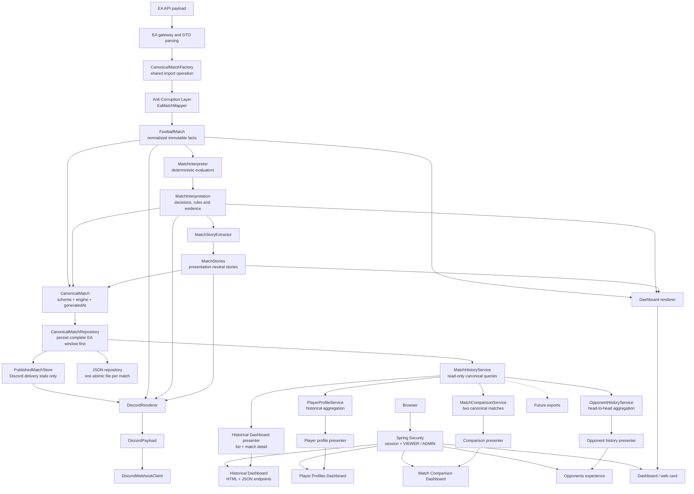

# Canonical architecture

## Purpose

The application turns EA SPORTS FC Pro Clubs payloads into deterministic,
auditable football interpretations and then renders them for external channels.
Football decisions belong to the canonical engine. A renderer may choose
language, layout and channel limits, but it may never select a winner,
recalculate a metric or reinterpret a statistic.

## Definitive architecture



### Access boundary

Spring Security is the web boundary in front of every page, API and static
resource. The only unauthenticated operational endpoint is the minimal
`/api/health`. VIEWER can read canonical sports experiences; ADMIN inherits that
access and can reach setup, settings and state-changing operations. Authorization
is enforced before controllers. Server-side sessions, BCrypt credentials and
CSRF protection remain presentation/application concerns and do not enter the
football domain or canonical persistence. See `docs/security.md` for the route
inventory and deployment configuration.

`MatchAcquisitionService` orchestrates this flow. It may handle EA DTOs at the
infrastructure boundary, but no DTO enters the domain, application rules or a
renderer. `CanonicalMatchFactory` is the single shared runtime operation from
`MatchResponse` through the ACL, interpretation and story extraction. Every
non-simulated match in a successful EA response is stored before publication
state is consulted.

## Layers and responsibilities

### EA infrastructure and ACL

The `ea` package owns gateways, browser/HTTP integration, JSON parsing and EA
DTOs. DTO fields may retain EA naming, optionality and string encodings.

`PlaywrightEaClubsGateway` uses one lazily initialized internal Chromium session
to establish the Akamai browser context and perform EA requests. Chromium is
headless by default and is closed with its page, context and Playwright runtime
when a request invalidates the session or Spring shuts down. This lifecycle is
independent from `DashboardAutoLauncher`, the only component allowed to ask
macOS to open the user's default browser.

The Linux container packages the same application and Playwright 1.47 browser
runtime without introducing another gateway. It binds the web server externally
through `app.web.network-enabled`, persists the existing application-support
directory in a volume and keeps canonical acquisition, interpretation and
rendering unchanged. The macOS bundle and container are distribution adapters
over the same runtime pipeline.

`ea.mapping` is the Anti-Corruption Layer and the only translator from
`MatchResponse` to `FootballMatch`. `EaMatchMapper`:

- parses string statistics into typed values;
- normalizes identities, competition, score and player roles;
- supplies documented fallbacks required by domain invariants;
- rejects unrecoverable identity or participant structure;
- normalizes inconsistent completed/attempted values;
- reports every anomaly through normalization issues.

No football award or narrative rule belongs in the ACL.

### Domain

`domain.match` owns immutable normalized facts:

- `FootballMatch`, match identity and time;
- clubs, participants and score;
- player identity, role and participation;
- attacking, passing, defending, discipline and goalkeeping statistics;
- EA recognition as a source fact, not as a presentation decision.

`domain.interpretation` owns decision contracts:

- outcome and eligibility;
- team metrics;
- Craque, Bagre and Xerife awards;
- contributions, highlights and match features;
- `RuleReference` and `DecisionEvidence`;
- the complete `MatchInterpretation`.

`domain.story` owns presentation-neutral narrative availability:

- semantic story type and narrative key;
- involved players and structured content;
- priority and ordering;
- provenance linking every story to rules and evidence.

The domain has no Spring, Jackson, EA DTO or Discord dependency.

### Application

`application.interpretation` is the single football decision engine:

- `MatchOutcomeEvaluator`;
- `PlayerEligibilityEvaluator`;
- `TeamMetricsCalculator`;
- `BagreEvaluator`, `CraqueEvaluator` and `XerifeEvaluator`;
- `MatchAwardsEvaluator`;
- `MatchFeaturesEvaluator`;
- `MatchInterpreter`, which composes one canonical interpretation.

`application.story.MatchStoryExtractor` projects decisions into `MatchStories`.
It does not re-evaluate candidates or statistics.

`application.repository.CanonicalMatchRepository` is the persistence port.
The engine produces no storage calls and has no knowledge of the concrete
repository.

### Canonical persistence

`CanonicalMatch` is the complete persistence envelope:

```text
CanonicalMatch
  schemaVersion
  engineVersion
  generatedAt
  FootballMatch
  MatchInterpretation
  MatchStories
```

Its constructor enforces that facts, interpretation and stories share the same
match ID. Derived convenience properties are not serialized, preventing
duplicate state from entering the stable format.

`CanonicalMatchRepository` supports:

- atomic save or replacement by `MatchId`;
- lookup by `MatchId`;
- deterministic listing by match time descending;
- repository metadata: count, time range, latest generation time and observed
  schema/engine versions.

`MatchHistoryService` is the read-only application boundary over that port. It
returns complete `CanonicalMatch` records without accessing EA or invoking the
football engine. Its generic query supports:

- all matches in deterministic newest-first or oldest-first order;
- latest `N` matches;
- lookup by `MatchId`;
- inclusive-start/exclusive-end periods;
- normalized competition;
- canonical player ID across participants;
- repository metadata.

Filters can be combined and the optional limit is applied after chronological
ordering. This service is the sole data boundary for the Historical Dashboard
and the future profile, comparison and export consumers; it contains no
football or presentation rules.

### Historical Dashboard

`MatchHistoryController` exposes the persisted history through:

- `GET /history`, the historical Dashboard;
- `GET /api/history/matches`, the newest-first match list and repository
  metadata;
- `GET /api/history/matches/{matchId}`, the complete historical match detail.

Its only data dependency is `MatchHistoryService`. It does not access the
repository, EA, `MatchInterpreter` or `MatchStoryExtractor`.

`HistoricalMatchPresenter` is a presentation-only projection of a
`CanonicalMatch`. It supplies localized labels and stable view models for:

- result, score, date, competition and clubs;
- the perspective club's players and persisted normalized statistics;
- Craque, Bagre, Xerife and their persisted supporting metrics;
- every canonical story, narrative key, involved player and provenance;
- canonical schema, engine and generation metadata.

The presenter may format dates, labels and already-computed values. It does not
sort candidates, calculate percentages, select awards or classify narratives.
The browser consumes only these historical JSON contracts and never calls the
EA acquisition endpoints.

### Player profiles

`PlayerProfileService` is the historical aggregation boundary for
player-centered product queries. It depends only on `MatchHistoryService` and
uses the newest-first canonical history to produce:

- a searchable index of players from the interpretation perspective club;
- matches, wins, draws and losses;
- average rating and the number of rated appearances;
- goals, assists and red cards;
- counts of canonical Craque, Bagre and Xerife decisions;
- the five latest appearances with their persisted match context.

The MVP intentionally includes players from the perspective club only.
Canonical outcomes and awards are defined from that perspective, so this scope
reuses them directly. Supporting opponent profiles would require an explicit
product decision about opponent identity and result perspective; the profile
layer does not infer or invert those decisions.

`PlayerProfile` and `PlayerProfileMatch` are historical query models. Their
sums, counts and rating average are product aggregations, not new football
rules. `PlayerProfilePresenter` owns localized labels and dates, while
`PlayerProfileController` depends only on `PlayerProfileService`.

The web surface exposes:

- `GET /players`, the profiles Dashboard;
- `GET /api/player-profiles`, the player index;
- `GET /api/player-profiles/detail?playerId=...`, one complete profile.

The query-parameter detail endpoint preserves arbitrary canonical player IDs
without requiring them to be safe URL path segments.

### Match comparison

`MatchComparisonService` is the application boundary for comparing two
persisted matches. It depends only on `MatchHistoryService`; it never accesses
the canonical repository, EA, ACL or football engine directly.

For each side, `ComparedMatch` preserves:

- date, competition, canonical outcome and score;
- team average, goals, assists, shots, passing, tackling, discipline and
  goalkeeper saves available in the canonical record;
- canonical Craque, Bagre and Xerife decisions;
- every `MatchStories` entry with its structured content and involved players.

`MatchDifferences` is a structured, presentation-neutral comparison containing:

- numeric differences as `second - first`, with explicit units and null when
  either value is unavailable;
- award winner changes by canonical player ID;
- story-presence differences by `StoryType`.

Pass accuracy is arithmetic over the persisted completed and attempted team
passes. It is not a new football classification. Possession is explicitly
unavailable because CanonicalMatch schema version 1 contains no possession
fact; the service and UI do not estimate it.

The comparison web surface exposes:

- `GET /compare`, the side-by-side Dashboard;
- `GET /api/match-comparisons/options`, selector data sourced through the
  comparison layer;
- `GET /api/match-comparisons?firstMatchId=...&secondMatchId=...`, the complete
  structured comparison.

`MatchComparisonPresenter` owns labels, date/number formatting and narrative
display. The browser calls only comparison endpoints and contains no football
rules.

### Opponent history

`OpponentHistoryService` builds deterministic head-to-head projections from
`MatchHistoryService`. Opponents are grouped exclusively by canonical `ClubId`;
the latest non-empty name is presentation metadata and never identity.

The service aggregates the exact record, goals, latest meeting, biggest wins
and losses, current and historical runs, and player leaders restricted to that
opponent. Existing match outcomes, player statistics and canonical awards are
reused without executing the football engine. Ties preserve every match,
sequence or player involved. Historical evidence identifies the opponent,
source MatchIds, criterion, tie policy and result.

The web surface exposes `GET /opponents`, `GET /opponents/{clubId}` and their
JSON APIs below `/api/opponents`. The legacy `GET /insights` redirects to
`/opponents`; it has no independent implementation.

`JsonCanonicalMatchRepository` is the initial infrastructure adapter. It stores
one UTF-8 JSON file per match below
`Application Support/EAFC26DiscordStats/canonical-matches`. Match IDs are
URL-safe encoded before becoming filenames. Writes use a sibling temporary file
and atomic replacement where supported. A malformed record fails explicitly
instead of silently removing history.

Development simulations are intentionally not persisted.

### Continuous canonical capture

The EA matches endpoint is configured with `maxResultCount=20`, while its
observed response is capped at ten recent matches. It exposes no usable cursor,
offset or page. Canonical persistence is therefore an accumulating local archive,
not a mirror of an unbounded EA history:

```text
EA recent league window
  -> deterministic order
  -> CanonicalMatchFactory for every returned match
  -> atomic save or replacement by MatchId
  -> PublishedMatchStore lookup
  -> Discord delivery for unpublished matches only
```

On the scheduler's first cycle with `publish-existing-on-first-run=false`, the
entire returned window is stored canonically before all returned IDs become the
Discord publication baseline. Manual and CLI acquisition still publish only the
latest eligible match, but persist the complete returned window first. Repeated
and overlapping windows replace existing records idempotently and add newly seen
MatchIds, allowing the archive to grow without a functional local limit.

`CanonicalBackfillService` provides the explicit
`backfill-canonical-matches` operation. It uses the same gateway,
`CanonicalMatchFactory` and repository as normal acquisition, but has no
Dashboard, renderer, webhook or `PublishedMatchStore` dependency.

The scheduler polls every 60 seconds. This is frequent relative to the ten-match
window, but cannot guarantee completeness: matches that leave the window before
any successful poll are unavailable through the current endpoint. In particular,
keeping the application stopped for more than ten league matches can leave a
permanent gap. Current capture is deliberately restricted to `leagueMatch`.
`playoffMatch` and `friendlyMatch` have separate recent windows and remain a
future, explicit expansion.

### Versioning strategy

- `schemaVersion` is an increasing positive integer. Version `1` defines the
  initial envelope and stable polymorphic `kind` names used by stories,
  evidence, roles and award metrics.
- Readers ignore unknown JSON properties, allowing additive fields within a
  schema. Removing, renaming or changing the meaning of a field requires a new
  schema version and an explicit migration/reader.
- The current adapter rejects unsupported schema versions rather than guessing.
- `engineVersion` uses semantic `major.minor.patch` form. Version `1.0.0`
  identifies the deterministic rules that generated the record.
- A football-rule behavior change must update the relevant `RuleReference`; a
  release containing meaningful rule changes must also advance
  `engineVersion`.
- Re-saving a match replaces its record atomically and records the version of
  the interpretation most recently generated.

### Renderers

`MatchSummaryBuilder` renders the Dashboard. `DiscordRenderer` renders both the
main and history Discord payloads. Both receive exactly:

- `FootballMatch` for normalized context and identity;
- `MatchInterpretation` for decisions and supporting metrics;
- `MatchStories` for available narratives and provenance.

Renderers may own:

- language, date and number formatting;
- copy, emojis, colors and visual hierarchy;
- phrase selection from configured phrase banks;
- field/section order;
- API limits such as Discord's two-story cap.

Renderers must not own:

- eligibility or candidate filtering;
- score or outcome resolution;
- award selection;
- ranking, aggregation or percentage calculation;
- football narrative classification.

### Runtime adapters

- `DiscordWebhookClient` serializes and sends an existing payload.
- `LatestMatchHolder` stores the latest Dashboard presentation.
- web controllers expose state without football decisions.
- schedulers and CLI trigger acquisition.
- `PublishedMatchStore` owns delivery deduplication and storage migration.
- `JsonCanonicalMatchRepository` owns durable canonical history; it does not
  decide football or presentation.
- `MatchHistoryService` organizes read-only canonical queries; it does not
  normalize, reinterpret or render matches.

## Dependency rules

Allowed:

```text
Runtime/infrastructure -> Application -> Domain
ACL                    -> Domain
Renderers              -> Domain + presentation configuration
Storage adapter        -> Canonical model + repository port
Tests                  -> production + retained test-only legacy baselines
```

Prohibited:

- Domain -> application, Spring, Jackson, EA DTOs or transports.
- Application -> EA DTOs, Discord, web or presentation types.
- Renderer -> EA DTO, ACL, selector or evaluator.
- ACL -> renderer or presentation model.
- Optional LLM -> winner selection, eligibility, metric interpretation or
  award decisions.
- Engine/domain -> concrete canonical storage.

These rules are guarded by `CanonicalProductionArchitectureTest`.

## Adding a football decision

1. Confirm the required source fact exists in `FootballMatch`. If it is
   EA-specific, normalize it in the ACL.
2. Define a presentation-neutral decision type in `domain.interpretation`.
3. Assign a stable, versioned `RuleReference`.
4. Produce sufficient `DecisionEvidence` for candidates, thresholds,
   exclusions and supporting metrics, including the no-decision path.
5. Implement the deterministic rule in `application.interpretation`.
6. Compose it through `MatchInterpreter`; do not call it from a renderer.
7. If narratively relevant, add structured `StoryContent` and project it from
   `MatchStoryExtractor`.
8. Test the rule, evidence, orchestration and renderer behavior separately.

Changing a rule's behavior requires a deliberate rule-version decision and
updated characterization documentation.

## Adding a renderer

A new Dashboard, Discord variant, LLM adapter, API or social-media renderer:

1. accepts `FootballMatch`, `MatchInterpretation` and `MatchStories`;
2. reads structured decisions and evidence without recalculating them;
3. owns only channel formatting, wording and delivery constraints;
4. remains independently testable from transport;
5. never imports EA DTOs or application evaluators;
6. uses semantic narrative keys for LLM prompts or localized copy;
7. adds architectural tests preventing decision logic from entering the
   adapter.

An LLM may rewrite an already interpreted story. It must not infer an award,
override eligibility or rank players.

## Preserved principles

- **Determinism:** equal normalized input and perspective produce equal
  interpretation and stories.
- **Traceability:** every decision identifies its rule and supporting evidence.
- **One canonical interpretation:** every consumer observes the same football
  decisions.
- **Presentation independence:** stories describe football meaning, not Discord
  fields or Dashboard sections.
- **Typed normalization:** raw EA strings stop at the ACL.
- **Backward-compatible delivery:** behavior changes are deliberate,
  documented and protected by characterization tests.

## Characterization retention

Legacy builders and evaluators are retained only under `src/test`. They are not
part of the production artifact and cannot create a parallel runtime decision
path. They remain valuable executable evidence for Dashboard and Discord shadow
parity. Historical divergence catalogs and ADRs remain part of the audit trail.
