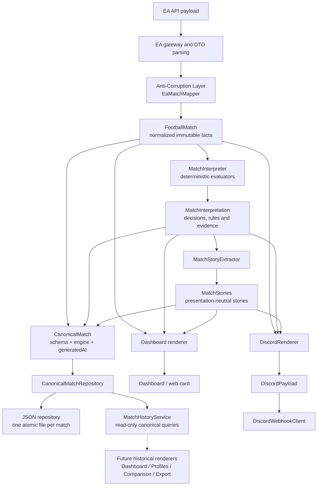

# Canonical architecture

## Purpose

The application turns EA SPORTS FC Pro Clubs payloads into deterministic,
auditable football interpretations and then renders them for external channels.
Football decisions belong to the canonical engine. A renderer may choose
language, layout and channel limits, but it may never select a winner,
recalculate a metric or reinterpret a statistic.

## Definitive architecture



`MatchAcquisitionService` orchestrates this flow. It may handle EA DTOs at the
infrastructure boundary, but no DTO enters the domain, application rules or a
renderer. Every non-simulated canonical result is stored before it becomes a
long-term product data source.

## Layers and responsibilities

### EA infrastructure and ACL

The `ea` package owns gateways, browser/HTTP integration, JSON parsing and EA
DTOs. DTO fields may retain EA naming, optionality and string encodings.

`ea.mapping` is the Anti-Corruption Layer and the only translator from
`MatchResponse` to `FootballMatch`. `EaMatchMapper`:

- parses string statistics into typed values;
- normalizes identities, competition, score and player roles;
- supplies documented fallbacks required by domain invariants;
- rejects unrecoverable identity or participant structure;
- normalizes inconsistent completed/attempted values;
- reports every anomaly through normalization issues.

No football award or narrative rule belongs in the ACL.

### Domain

`domain.match` owns immutable normalized facts:

- `FootballMatch`, match identity and time;
- clubs, participants and score;
- player identity, role and participation;
- attacking, passing, defending, discipline and goalkeeping statistics;
- EA recognition as a source fact, not as a presentation decision.

`domain.interpretation` owns decision contracts:

- outcome and eligibility;
- team metrics;
- Craque, Bagre and Xerife awards;
- contributions, highlights and match features;
- `RuleReference` and `DecisionEvidence`;
- the complete `MatchInterpretation`.

`domain.story` owns presentation-neutral narrative availability:

- semantic story type and narrative key;
- involved players and structured content;
- priority and ordering;
- provenance linking every story to rules and evidence.

The domain has no Spring, Jackson, EA DTO or Discord dependency.

### Application

`application.interpretation` is the single football decision engine:

- `MatchOutcomeEvaluator`;
- `PlayerEligibilityEvaluator`;
- `TeamMetricsCalculator`;
- `BagreEvaluator`, `CraqueEvaluator` and `XerifeEvaluator`;
- `MatchAwardsEvaluator`;
- `MatchFeaturesEvaluator`;
- `MatchInterpreter`, which composes one canonical interpretation.

`application.story.MatchStoryExtractor` projects decisions into `MatchStories`.
It does not re-evaluate candidates or statistics.

`application.repository.CanonicalMatchRepository` is the persistence port.
The engine produces no storage calls and has no knowledge of the concrete
repository.

### Canonical persistence

`CanonicalMatch` is the complete persistence envelope:

```text
CanonicalMatch
  schemaVersion
  engineVersion
  generatedAt
  FootballMatch
  MatchInterpretation
  MatchStories
```

Its constructor enforces that facts, interpretation and stories share the same
match ID. Derived convenience properties are not serialized, preventing
duplicate state from entering the stable format.

`CanonicalMatchRepository` supports:

- atomic save or replacement by `MatchId`;
- lookup by `MatchId`;
- deterministic listing by match time descending;
- repository metadata: count, time range, latest generation time and observed
  schema/engine versions.

`MatchHistoryService` is the read-only application boundary over that port. It
returns complete `CanonicalMatch` records without accessing EA or invoking the
football engine. Its generic query supports:

- all matches in deterministic newest-first or oldest-first order;
- latest `N` matches;
- lookup by `MatchId`;
- inclusive-start/exclusive-end periods;
- normalized competition;
- canonical player ID across participants;
- repository metadata.

Filters can be combined and the optional limit is applied after chronological
ordering. This service is the input boundary for future historical Dashboard,
profile, comparison and export renderers; it contains no football or
presentation rules.

`JsonCanonicalMatchRepository` is the initial infrastructure adapter. It stores
one UTF-8 JSON file per match below
`Application Support/EAFC26DiscordStats/canonical-matches`. Match IDs are
URL-safe encoded before becoming filenames. Writes use a sibling temporary file
and atomic replacement where supported. A malformed record fails explicitly
instead of silently removing history.

Development simulations are intentionally not persisted.

### Versioning strategy

- `schemaVersion` is an increasing positive integer. Version `1` defines the
  initial envelope and stable polymorphic `kind` names used by stories,
  evidence, roles and award metrics.
- Readers ignore unknown JSON properties, allowing additive fields within a
  schema. Removing, renaming or changing the meaning of a field requires a new
  schema version and an explicit migration/reader.
- The current adapter rejects unsupported schema versions rather than guessing.
- `engineVersion` uses semantic `major.minor.patch` form. Version `1.0.0`
  identifies the deterministic rules that generated the record.
- A football-rule behavior change must update the relevant `RuleReference`; a
  release containing meaningful rule changes must also advance
  `engineVersion`.
- Re-saving a match replaces its record atomically and records the version of
  the interpretation most recently generated.

### Renderers

`MatchSummaryBuilder` renders the Dashboard. `DiscordRenderer` renders both the
main and history Discord payloads. Both receive exactly:

- `FootballMatch` for normalized context and identity;
- `MatchInterpretation` for decisions and supporting metrics;
- `MatchStories` for available narratives and provenance.

Renderers may own:

- language, date and number formatting;
- copy, emojis, colors and visual hierarchy;
- phrase selection from configured phrase banks;
- field/section order;
- API limits such as Discord's two-story cap.

Renderers must not own:

- eligibility or candidate filtering;
- score or outcome resolution;
- award selection;
- ranking, aggregation or percentage calculation;
- football narrative classification.

### Runtime adapters

- `DiscordWebhookClient` serializes and sends an existing payload.
- `LatestMatchHolder` stores the latest Dashboard presentation.
- web controllers expose state without football decisions.
- schedulers and CLI trigger acquisition.
- `PublishedMatchStore` owns delivery deduplication and storage migration.
- `JsonCanonicalMatchRepository` owns durable canonical history; it does not
  decide football or presentation.
- `MatchHistoryService` organizes read-only canonical queries; it does not
  normalize, reinterpret or render matches.

## Dependency rules

Allowed:

```text
Runtime/infrastructure -> Application -> Domain
ACL                    -> Domain
Renderers              -> Domain + presentation configuration
Storage adapter        -> Canonical model + repository port
Tests                  -> production + retained test-only legacy baselines
```

Prohibited:

- Domain -> application, Spring, Jackson, EA DTOs or transports.
- Application -> EA DTOs, Discord, web or presentation types.
- Renderer -> EA DTO, ACL, selector or evaluator.
- ACL -> renderer or presentation model.
- Optional LLM -> winner selection, eligibility, metric interpretation or
  award decisions.
- Engine/domain -> concrete canonical storage.

These rules are guarded by `CanonicalProductionArchitectureTest`.

## Adding a football decision

1. Confirm the required source fact exists in `FootballMatch`. If it is
   EA-specific, normalize it in the ACL.
2. Define a presentation-neutral decision type in `domain.interpretation`.
3. Assign a stable, versioned `RuleReference`.
4. Produce sufficient `DecisionEvidence` for candidates, thresholds,
   exclusions and supporting metrics, including the no-decision path.
5. Implement the deterministic rule in `application.interpretation`.
6. Compose it through `MatchInterpreter`; do not call it from a renderer.
7. If narratively relevant, add structured `StoryContent` and project it from
   `MatchStoryExtractor`.
8. Test the rule, evidence, orchestration and renderer behavior separately.

Changing a rule's behavior requires a deliberate rule-version decision and
updated characterization documentation.

## Adding a renderer

A new Dashboard, Discord variant, LLM adapter, API or social-media renderer:

1. accepts `FootballMatch`, `MatchInterpretation` and `MatchStories`;
2. reads structured decisions and evidence without recalculating them;
3. owns only channel formatting, wording and delivery constraints;
4. remains independently testable from transport;
5. never imports EA DTOs or application evaluators;
6. uses semantic narrative keys for LLM prompts or localized copy;
7. adds architectural tests preventing decision logic from entering the
   adapter.

An LLM may rewrite an already interpreted story. It must not infer an award,
override eligibility or rank players.

## Preserved principles

- **Determinism:** equal normalized input and perspective produce equal
  interpretation and stories.
- **Traceability:** every decision identifies its rule and supporting evidence.
- **One canonical interpretation:** every consumer observes the same football
  decisions.
- **Presentation independence:** stories describe football meaning, not Discord
  fields or Dashboard sections.
- **Typed normalization:** raw EA strings stop at the ACL.
- **Backward-compatible delivery:** behavior changes are deliberate,
  documented and protected by characterization tests.

## Characterization retention

Legacy builders and evaluators are retained only under `src/test`. They are not
part of the production artifact and cannot create a parallel runtime decision
path. They remain valuable executable evidence for Dashboard and Discord shadow
parity. Historical divergence catalogs and ADRs remain part of the audit trail.
